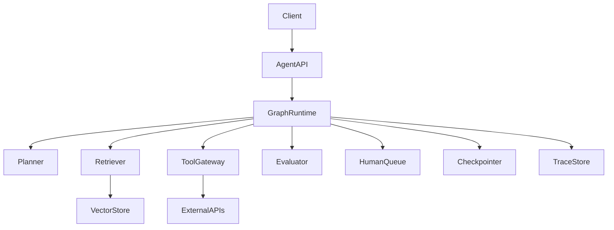

# Agentic AI System Design Notes

## Design A Production Research Agent

Requirements:

- Accept a research goal.
- Plan subquestions.
- Retrieve internal and external evidence.
- Grade evidence quality.
- Draft an answer with citations.
- Ask for human approval before publishing.
- Trace every step.

## High-Level Architecture

## Key Decisions

- Keep tool execution in application code, not inside the model.
- Store graph state separately from long-term user memory.
- Add approval interrupts before irreversible actions.
- Build evaluation before launch.
- Use feature flags and compare traces across versions.
