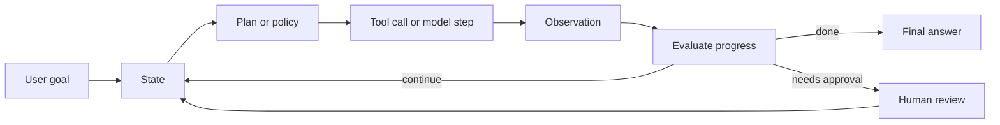

# Agentic AI Roadmap

Agentic AI is the step beyond one-shot text generation. A normal generative AI application receives an input and produces an output. An agentic system receives a goal, maintains state, chooses actions, calls tools, observes results, and decides what to do next until a stopping condition is met.

## The Core Loop

An agentic application is not just a bigger prompt. It is a runtime that controls:

- State: what the system currently knows about the task.
- Tools: actions the model can request, such as search, database lookup, calculator, code execution, ticket creation, or email draft creation.
- Policy: rules deciding when to use the model, when to use a tool, when to stop, and when to ask a human.
- Memory: short-term working context for the current thread and long-term facts across sessions.
- Observation: structured outputs from tools, validators, evaluators, and humans.
- Recovery: retries, fallbacks, checkpoints, time travel, and manual intervention.

## Generative AI vs Agentic AI

Generative AI is output oriented. It is ideal for summarization, drafting, classification, extraction, and transformation when the input already contains enough context. Agentic AI is task oriented. It is ideal when the system must gather missing context, take multiple steps, branch based on intermediate results, use tools, or operate over time.

A good interview answer is: "Generative AI answers; agentic AI acts. Generative AI predicts the next useful output; an agentic system wraps the model inside a loop that can plan, call tools, update state, evaluate progress, and recover from failures."

## Capability Ladder

1. Prompt: single model call.
2. Chain: deterministic sequence of model and parser calls.
3. Tool calling: model can request external functions.
4. Workflow: code owns the control flow; the model fills in decisions or content.
5. Agent: model participates in deciding next action.
6. Multi-agent system: multiple specialized loops coordinate.

Production systems usually mix deterministic workflow and agentic behavior. The safest architecture is rarely "let the model do anything." It is usually "give the model bounded decisions inside a workflow that validates each step."

## The Mental Model For This Repo

This repo studies agentic AI through two connected stacks:

- LangChain: useful for model abstraction, prompts, parsers, structured output, tools, chains, runnables, loaders, splitters, vector stores, retrievers, and agent harnesses.
- LangGraph: useful for explicit orchestration, stateful graphs, conditional routing, persistence, memory, streaming, human-in-the-loop, subgraphs, and long-running agents.

The code in this repo is intentionally dependency-light so it can run without API keys. It mirrors the concepts with a small educational runtime, then explains how each idea maps to LangChain and LangGraph.
