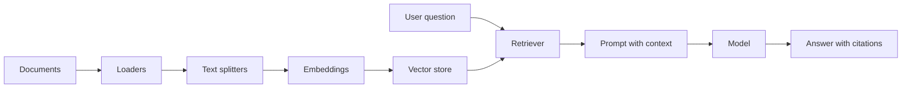

# Retrieval Augmented Generation

RAG gives an LLM access to external knowledge at answer time. Instead of relying only on model weights, the application retrieves relevant documents and includes them as context.

## RAG Pipeline

## Document Loaders

Loaders ingest data from PDFs, web pages, YouTube transcripts, Markdown, databases, APIs, CSV files, and more. A loader should preserve metadata such as source URL, page number, section title, timestamp, and access permissions.

## Text Splitters

Chunking controls retrieval quality. Chunks that are too small lose context. Chunks that are too large dilute relevance and waste tokens. Good chunking respects semantic boundaries: headings, paragraphs, code blocks, tables, and conversation turns.

## Vector Stores

Vector stores index embedding vectors for similarity search. They are useful when lexical match is insufficient. In practice, high-quality retrieval often combines dense vector search, keyword search, metadata filters, and reranking.

## Retrievers

A retriever is the query-time component that returns documents. Common retriever upgrades:

- Query rewriting for unclear questions.
- Multi-query retrieval for broader coverage.
- Parent-child retrieval for small chunks with larger context.
- Metadata filtering for permission, date, product, or tenant.
- Reranking to improve top-k quality.

## RAG Failure Modes

- Missing document ingestion.
- Poor chunk boundaries.
- Embedding mismatch with domain terms.
- Retrieval returns distractors.
- Prompt ignores retrieved evidence.
- Answer lacks citations.
- User lacks permission for retrieved content.

A production RAG system needs evaluation datasets, retrieval metrics, answer faithfulness checks, and observability for every query.
