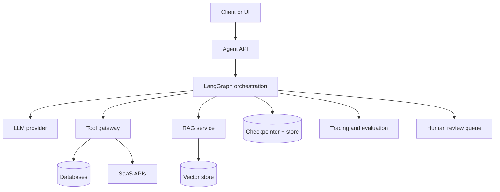

# Production Agentic Systems

A production agent is a distributed system with a probabilistic component. Treat it with the same seriousness as any backend service: versioning, testing, observability, access control, rollback, incident handling, and cost management.

## Reference Architecture

## Security

- Authenticate every user.
- Authorize every document and tool access.
- Keep secrets out of prompts and traces.
- Redact sensitive tool observations.
- Use scoped service accounts.
- Require approval for external writes.
- Log every side effect.

## Reliability

- Make write tools idempotent.
- Add timeouts and retries for tools.
- Use circuit breakers for unreliable dependencies.
- Persist state before long-running steps.
- Define fallback answers and escalation paths.
- Test routing and parser failures, not only happy paths.

## Deployment

- Version prompts, graphs, tools, and evaluators.
- Run regression suites before deployment.
- Deploy behind feature flags.
- Compare old and new traces.
- Monitor cost, latency, and failure rate.
- Roll back quickly if hallucination or tool failure increases.

## When Not To Use An Agent

Do not use an autonomous agent when a deterministic API call, SQL query, rules engine, or simple chain solves the problem. Agents are valuable when uncertainty, multi-step reasoning, tool use, and dynamic control flow are real requirements.
