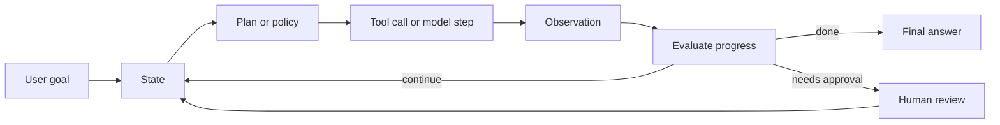
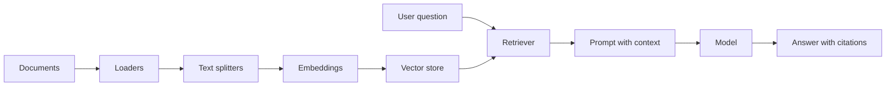
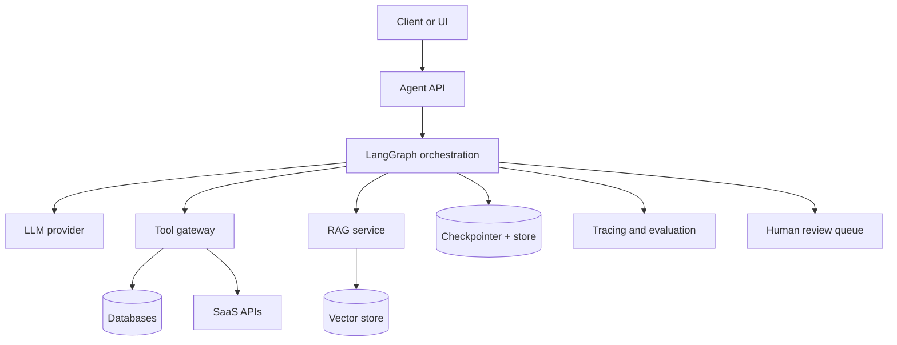

# Agentic Systems Study Guide

    Generated on 2026-06-25.

    Playlist sources:

    - Agentic AI using LangGraph: https://www.youtube.com/playlist?list=PLKnIA16_RmvYsvB8qkUQuJmJNuiCUJFPL
    - LangChain for Beginners / GenAI using LangChain: https://www.youtube.com/playlist?list=PL8n_RR1gqRmycHk4pYlQPYd2RoqE5fHCF

    Official documentation references:

    - LangChain overview: https://docs.langchain.com/oss/python/langchain/overview
- LangGraph overview: https://docs.langchain.com/oss/python/langgraph/overview
- LangGraph persistence: https://docs.langchain.com/oss/python/langgraph/persistence
- LangGraph interrupts / human in the loop: https://docs.langchain.com/oss/python/langgraph/interrupts
- LangSmith tracing quickstart: https://docs.langchain.com/langsmith/observability-quickstart

    # Agentic AI Roadmap

Agentic AI is the step beyond one-shot text generation. A normal generative AI application receives an input and produces an output. An agentic system receives a goal, maintains state, chooses actions, calls tools, observes results, and decides what to do next until a stopping condition is met.

## The Core Loop



An agentic application is not just a bigger prompt. It is a runtime that controls:

- State: what the system currently knows about the task.
- Tools: actions the model can request, such as search, database lookup, calculator, code execution, ticket creation, or email draft creation.
- Policy: rules deciding when to use the model, when to use a tool, when to stop, and when to ask a human.
- Memory: short-term working context for the current thread and long-term facts across sessions.
- Observation: structured outputs from tools, validators, evaluators, and humans.
- Recovery: retries, fallbacks, checkpoints, time travel, and manual intervention.

## Generative AI vs Agentic AI

Generative AI is output oriented. It is ideal for summarization, drafting, classification, extraction, and transformation when the input already contains enough context. Agentic AI is task oriented. It is ideal when the system must gather missing context, take multiple steps, branch based on intermediate results, use tools, or operate over time.

A good interview answer is: "Generative AI answers; agentic AI acts. Generative AI predicts the next useful output; an agentic system wraps the model inside a loop that can plan, call tools, update state, evaluate progress, and recover from failures."

## Capability Ladder

1. Prompt: single model call.
2. Chain: deterministic sequence of model and parser calls.
3. Tool calling: model can request external functions.
4. Workflow: code owns the control flow; the model fills in decisions or content.
5. Agent: model participates in deciding next action.
6. Multi-agent system: multiple specialized loops coordinate.

Production systems usually mix deterministic workflow and agentic behavior. The safest architecture is rarely "let the model do anything." It is usually "give the model bounded decisions inside a workflow that validates each step."

## The Mental Model For This Repo

This repo studies agentic AI through two connected stacks:

- LangChain: useful for model abstraction, prompts, parsers, structured output, tools, chains, runnables, loaders, splitters, vector stores, retrievers, and agent harnesses.
- LangGraph: useful for explicit orchestration, stateful graphs, conditional routing, persistence, memory, streaming, human-in-the-loop, subgraphs, and long-running agents.

The code in this repo is intentionally dependency-light so it can run without API keys. It mirrors the concepts with a small educational runtime, then explains how each idea maps to LangChain and LangGraph.

# LangChain Foundations

LangChain is best understood as a composition layer for LLM applications. It gives you abstractions for models, prompts, messages, tools, structured outputs, parsers, retrieval components, and runnable pipelines.

## Core Components

- Model: a provider-independent interface to chat models, completion models, or embedding models.
- Message: a structured record such as system, human, assistant, or tool message.
- Prompt: a reusable template that prepares instructions and context.
- Structured output: a way to force model responses into a schema like JSON or Pydantic.
- Output parser: a component that validates and transforms model text into typed data.
- Chain: a sequence of steps where the output of one step becomes input to the next.
- Runnable: a composable execution unit that supports invoke, batch, stream, and composition.
- Tool: a callable function with a description and schema that a model or workflow can use.
- Retriever: a component that returns relevant documents for a query.

## Why Runnables Matter

Runnables are important because they standardize execution. A prompt, model, parser, retriever, lambda transform, or branch can all behave like a runnable. That makes pipelines easier to test, stream, batch, trace, and replace.

A typical chain looks like:

```text
user question -> prompt template -> model -> parser -> typed answer
```

A richer retrieval chain looks like:

```text
user question -> retriever -> context formatter -> prompt -> model -> answer parser
```

## Prompt Engineering For Agentic Systems

Agentic prompts should not only say "be helpful." They should define the role, available tools, constraints, output schema, stopping rules, and escalation policy. Good prompts reduce ambiguity before runtime logic begins.

A practical structure:

- Identity: what the agent is responsible for.
- Context: facts, documents, user profile, prior state.
- Tools: what each tool does and when to use it.
- Policy: what is allowed, what requires approval, what is forbidden.
- Output contract: JSON schema, bullet format, citations, confidence score, or action plan.
- Failure behavior: what to do when context is missing, a tool fails, or the answer is uncertain.

## Structured Output And Parsers

Free-form text is hard to test and hard to route. Structured output lets downstream code reliably read fields such as decision, confidence, entities, next_action, citations, or tool_request. In production, never assume the model complied. Parse, validate, repair when safe, and fail closed for risky actions.

## LangChain vs LangGraph

Use LangChain when you want a compact harness around models, prompts, tools, retrieval, and a common agent loop. Use LangGraph when you need explicit state, branching, checkpointing, human review, time travel, subgraphs, or durable long-running workflows.

# LangGraph Foundations

LangGraph is a low-level orchestration framework for stateful agent workflows. The central idea is simple: define a state schema, define nodes that transform state, connect nodes with edges, and compile the graph into an executable runtime.

## Graph Terms

- State: the shared data object carried through the graph.
- Node: a function that reads state and returns updates.
- Edge: a transition from one node to another.
- Conditional edge: routing logic that picks the next node based on current state.
- START and END: special boundaries of the graph.
- Reducer: merge logic for combining state updates, especially for message lists or parallel branches.
- Checkpointer: persistence for thread-scoped graph state.
- Store: long-term application memory outside one graph thread.
- Interrupt: a controlled pause that waits for external input before resuming.

## Why Graphs Are Useful

Agentic systems become hard to reason about when the loop is hidden inside one while-loop prompt. A graph makes the control flow explicit. You can inspect the state at every node, test each node independently, add checkpoints, and route errors to recovery nodes.

## State Design

Good state design is the heart of LangGraph. State should contain the minimum durable information needed to continue the task. Avoid dumping every raw prompt and document into state. Separate:

- working state: current question, draft, retrieved docs, selected tool, pending approval.
- execution metadata: attempts, trace id, timestamps, latency, errors.
- memory references: user id, thread id, document ids, vector store keys.
- final output: answer, citations, confidence, next steps.

## Node Design

Nodes should be idempotent when possible. If a node sends an email, creates a ticket, charges money, or writes to a database, guard it with an approval node or a de-duplication key. This matters because durable systems can retry after failure.

## Conditional Routing

Conditional routing is where LangGraph becomes more than a chain. The router may inspect confidence, missing fields, tool results, policy status, or evaluator output. This enables patterns like:

- answer directly if confidence is high.
- retrieve if context is missing.
- ask human if the action is risky.
- retry if output is invalid.
- stop if max iterations is reached.

# Workflow Patterns

Agentic systems are easier to design when you recognize recurring workflow shapes. The playlist covers sequential, parallel, conditional, and iterative workflows; these are the building blocks for most production agents.

## Sequential Workflow

A sequential workflow is a pipeline: step A, then B, then C. It is best when order is fixed and each step depends on the previous output.

Example: classify ticket -> retrieve policy -> draft response -> validate response -> send to human.

Strengths: predictable, testable, easy to trace. Weakness: slow if independent steps could run in parallel.

## Parallel Workflow

A parallel workflow fans out independent work and then merges results. This is useful for research agents, multi-source retrieval, multi-criteria evaluation, or generating multiple drafts.

Example: search docs, search tickets, search web, and search database at the same time; merge the evidence before answering.

Key design issue: define merge semantics. Do you concatenate, rank, vote, deduplicate, or ask an evaluator to synthesize?

## Conditional Workflow

A conditional workflow routes based on state. For example, if retrieval confidence is low, ask a clarifying question; if confidence is medium, retrieve more; if confidence is high, answer.

Conditional routing should be explicit and observable. Log the route decision and the features used to make it.

## Iterative Workflow

Iterative workflows loop until a condition is met. Examples include ReAct agents, self-reflection, query rewriting, CRAG, Self-RAG, and planner-executor systems.

Every loop needs:

- a clear progress signal.
- a maximum iteration limit.
- a way to detect repeated failure.
- state summaries to prevent context bloat.
- final fallback behavior.

## Choosing The Pattern

Start deterministic. If the path is known, use a chain. If work is independent, use parallel branches. If decisions depend on evidence, use conditional routing. If the system must improve over multiple attempts, use an iterative loop with strict stopping rules.

# Memory, Persistence, And Time Travel

LLMs do not remember by themselves between calls. A stateless model only sees the current prompt. Memory is an application responsibility: you decide what to store, where to store it, when to retrieve it, and how to summarize it.

## Short-Term Memory

Short-term memory is thread-scoped. It preserves the current conversation, graph state, tool observations, drafts, and pending actions. In LangGraph, this is commonly handled through checkpointers. A checkpointer lets a graph resume from a specific thread id.

Use short-term memory for:

- conversation continuity.
- resuming after errors.
- human-in-the-loop approvals.
- time travel debugging.
- iterative loops where previous attempts matter.

## Long-Term Memory

Long-term memory is cross-thread. It stores durable facts such as user preferences, reusable summaries, learned entities, project details, or application knowledge. It should be intentionally curated. Storing every message forever creates privacy, cost, and quality problems.

Types of long-term memory:

- Semantic memory: facts about the user or domain.
- Episodic memory: important events and decisions.
- Procedural memory: instructions and learned preferences.
- Knowledge memory: documents, tickets, pages, or indexed repositories.

## Time Travel

Time travel means inspecting or replaying previous graph states. It is useful for debugging agent behavior: you can see why a router chose a path, why a tool was called, what state existed before an error, and how a different human decision would change the outcome.

## Memory Quality Rules

- Store only useful information.
- Attach source, timestamp, and confidence.
- Separate user-provided facts from model-inferred facts.
- Make deletion and correction possible.
- Do not let memory silently override current user instructions.

# Tools, Tool Calling, And MCP

Tools turn an LLM application from a text generator into an action system. A tool is a callable capability with a name, description, input schema, output contract, and security policy.

## Tool Calling Flow

```text
user goal -> model decides tool + arguments -> validate arguments -> run tool -> observe result -> model continues
```

Tool calling is powerful because the model can access fresh data, perform calculations, call APIs, query databases, or update external systems. It is risky because a wrong call can leak data or cause side effects.

## Tool Design

A good tool should be narrow, typed, and easy to verify.

- Prefer `search_customer_orders(customer_id)` over `run_sql(query)`.
- Prefer enums and schemas over free text.
- Return structured observations, not long unbounded text.
- Include error codes so the agent can recover.
- Add idempotency keys for write actions.

## Tool Policies

Production agents need policies:

- Allowlist which tools are available for the current user and task.
- Require approval for destructive or external write actions.
- Redact secrets before sending observations to the model.
- Rate-limit expensive tools.
- Log every tool request, arguments, result status, and latency.

## MCP

Model Context Protocol standardizes how tools and resources can be exposed to an AI client. Instead of hardcoding every integration into the application, an MCP server can publish tools, resource access, and schemas. A LangGraph MCP client can list tools, choose a tool, call it with JSON arguments, and feed the observation back into graph state.

MCP is especially useful for enterprise systems because integrations such as Jira, Confluence, GitHub, databases, and internal APIs can be exposed behind one protocol boundary.

# Retrieval Augmented Generation

RAG gives an LLM access to external knowledge at answer time. Instead of relying only on model weights, the application retrieves relevant documents and includes them as context.

## RAG Pipeline



## Document Loaders

Loaders ingest data from PDFs, web pages, YouTube transcripts, Markdown, databases, APIs, CSV files, and more. A loader should preserve metadata such as source URL, page number, section title, timestamp, and access permissions.

## Text Splitters

Chunking controls retrieval quality. Chunks that are too small lose context. Chunks that are too large dilute relevance and waste tokens. Good chunking respects semantic boundaries: headings, paragraphs, code blocks, tables, and conversation turns.

## Vector Stores

Vector stores index embedding vectors for similarity search. They are useful when lexical match is insufficient. In practice, high-quality retrieval often combines dense vector search, keyword search, metadata filters, and reranking.

## Retrievers

A retriever is the query-time component that returns documents. Common retriever upgrades:

- Query rewriting for unclear questions.
- Multi-query retrieval for broader coverage.
- Parent-child retrieval for small chunks with larger context.
- Metadata filtering for permission, date, product, or tenant.
- Reranking to improve top-k quality.

## RAG Failure Modes

- Missing document ingestion.
- Poor chunk boundaries.
- Embedding mismatch with domain terms.
- Retrieval returns distractors.
- Prompt ignores retrieved evidence.
- Answer lacks citations.
- User lacks permission for retrieved content.

A production RAG system needs evaluation datasets, retrieval metrics, answer faithfulness checks, and observability for every query.

# Corrective RAG And Self-RAG

Advanced RAG techniques add feedback loops around retrieval and generation. The goal is to reduce hallucination and improve answer grounding.

## Corrective RAG

Corrective RAG, often called CRAG, evaluates whether retrieved documents are good enough. If retrieval is weak, the system can rewrite the query, retrieve again, use a fallback source, or ask for clarification.

A CRAG graph usually has:

- retrieve node.
- grade-documents node.
- transform-query node.
- fallback-search node.
- generate node.
- answer-grade node.

The key insight is that retrieval is not automatically trusted. Retrieved documents become evidence only after grading.

## Self-RAG

Self-RAG makes the generation step reflective. The system decides whether retrieval is needed, checks whether passages support the answer, and judges whether the final answer addresses the question.

A practical Self-RAG loop:

1. Decide if retrieval is required.
2. Retrieve candidate passages.
3. Grade relevance of each passage.
4. Generate answer from supported passages.
5. Check answer support and completeness.
6. Retry or abstain if the answer is unsupported.

## Design Tradeoffs

CRAG and Self-RAG improve reliability but add latency and cost. Use them when correctness matters: legal, medical, finance, compliance, customer support, production incident response, or interview-grade technical explanations.

For low-risk creative tasks, simple RAG may be enough. For high-risk tasks, pair advanced RAG with citations, evaluator traces, and human escalation.

# Observability And LangSmith

Agentic systems need observability because failures are often hidden inside intermediate steps. The final answer may be wrong because retrieval failed, a parser repaired bad JSON incorrectly, a router chose the wrong branch, a tool timed out, or a loop stopped too early.

## What To Trace

- User input and sanitized prompt.
- Model calls, parameters, latency, token usage, and response.
- Tool calls, arguments, output, error status, and latency.
- Retriever queries, returned document ids, scores, and metadata.
- Graph node transitions and state updates.
- Human approvals, edits, and rejected actions.
- Evaluator scores and regression results.

## Metrics

- Task success rate.
- Tool success and failure rate.
- Retrieval precision at k.
- Faithfulness or groundedness.
- Hallucination rate.
- Average cost per task.
- P95 latency.
- Human escalation rate.
- Retry count and loop iterations.

## Evaluation

Evaluation should exist before production. Build a small golden dataset of realistic tasks and expected properties. For RAG, include questions with known source documents. For agents, include tool-call expectations, route expectations, and safety constraints.

## Debugging With Traces

A trace should let you answer:

- What did the agent know when it made this decision?
- Which tool did it call and why?
- Did retrieval return the right evidence?
- Did the model ignore evidence?
- Was the final answer validated?
- Where did latency and cost accumulate?

# Human In The Loop

Human-in-the-loop means the agent can pause, expose state, ask for approval or correction, and resume. This is essential when decisions are high impact, ambiguous, irreversible, or require domain judgement.

## Common HITL Patterns

- Approval: human approves a tool action before it runs.
- Review and edit: human edits the draft or state.
- Clarification: human supplies missing information.
- Escalation: agent hands off when confidence is low.
- Audit: human reviews traces after execution.

## What To Show The Human

Do not show only "Approve?" Show the relevant state:

- Goal.
- Proposed action.
- Tool name and arguments.
- Evidence used.
- Risk level.
- Expected side effect.
- Reversal plan if applicable.

## Resuming Safely

On resume, the system should use a stable thread id and checkpoint. Side effects before an interrupt must be idempotent or avoided. For example, draft before interrupt, send after approval. If the graph retries, it should not send the same email twice.

## Interview Answer

"I use HITL when the model is making a high-impact decision or triggering side effects. The graph pauses at an interrupt, persists state, exposes a structured approval payload, receives human input, and resumes from the checkpoint. This gives safety without losing automation."

# Production Agentic Systems

A production agent is a distributed system with a probabilistic component. Treat it with the same seriousness as any backend service: versioning, testing, observability, access control, rollback, incident handling, and cost management.

## Reference Architecture



## Security

- Authenticate every user.
- Authorize every document and tool access.
- Keep secrets out of prompts and traces.
- Redact sensitive tool observations.
- Use scoped service accounts.
- Require approval for external writes.
- Log every side effect.

## Reliability

- Make write tools idempotent.
- Add timeouts and retries for tools.
- Use circuit breakers for unreliable dependencies.
- Persist state before long-running steps.
- Define fallback answers and escalation paths.
- Test routing and parser failures, not only happy paths.

## Deployment

- Version prompts, graphs, tools, and evaluators.
- Run regression suites before deployment.
- Deploy behind feature flags.
- Compare old and new traces.
- Monitor cost, latency, and failure rate.
- Roll back quickly if hallucination or tool failure increases.

## When Not To Use An Agent

Do not use an autonomous agent when a deterministic API call, SQL query, rules engine, or simple chain solves the problem. Agents are valuable when uncertainty, multi-step reasoning, tool use, and dynamic control flow are real requirements.

    # Video Coverage Checklist

    ## Agentic AI using LangGraph
- 01. Agentic AI using LangGraph | New Playlist | LangGraph Tutorial - Agentic AI (yC36gN-rqjo)
- 02. Generative AI vs Agentic AI | Agentic AI using LangGraph | Video 1 - Generative AI vs agentic AI (xdA0pGDiUPE)
- 03. What is Agentic AI? | Agentic AI using LangGraph | Video 2 - Agentic AI fundamentals (GWnSsjT4V68)
- 04. LangChain Vs LangGraph | Agentic AI using LangGraph | Video 3 - Framework selection (31qyMKNB2RA)
- 05. LangGraph Core Concepts | Agentic AI using LangGraph | Video 4 - LangGraph core concepts (D5KhiCDM9XQ)
- 06. Sequential Workflows in LangGraph | Agentic AI using LangGraph | Video 5 - Sequential workflow (bAWujyAl1Kk)
- 07. Parallel Workflows in LangGraph | Agentic AI using LangGraph | Video 6 - Parallel workflow (O6ryuSpqdOw)
- 08. Conditional Workflows in LangGraph | Agentic AI using LangGraph | Video 7 - Conditional routing (I-dvZqTz-Wc)
- 09. Iterative Workflows in LangGraph | Agentic AI using LangGraph | Video 8 - Iterative loop (7CbSqrovcsE)
- 10. How to build a Chatbot using LangGraph - Chatbots (51Ve2tE3Zns)
- 11. Persistence in LangGraph | Time Travel in LangGraph - Persistence and time travel (_IPP7_Bi8uA)
- 12. Building a Chatbot with UI in LangGraph & Streamlit - Chatbots (voZAgDmO-rk)
- 13. Streaming in LangGraph - Streaming (D1PcZaeQ2eg)
- 14. How to build a Resume Chat feature like ChatGPT? - Resume chat and document Q&A (N2nVG2MGWJ8)
- 15. LangGraph + SQLite | Chatbot with Database Integration - Chatbots (c6a47iX5JkU)
- 16. LangSmith Crash Course | LangSmith Tutorial for Beginners | Observability in GenAI - Observability (4FFspU4riHk)
- 17. Observability in LangGraph | LangSmith Integration with LangGraph - Observability (ikzN6byFNWw)
- 18. Tools in LangGraph | Agentic AI using LangGraph - Tools (_UuUigoM9MA)
- 19. How to build MCP Client using LangGraph | Agentic AI using LangGraph - Model Context Protocol (yZGjVA4uDc4)
- 20. RAG using LangGraph | Agentic AI using LangGraph - Retrieval augmented generation (E1qP9Xsnmik)
- 21. Human in the loop (HITL) using LangGraph - Human in the loop (xxqZzVZ4gE0)
- 22. How to build Subgraphs in LangGraph - Subgraphs (wcHcocpAoX4)
- 23. LLMs Don't Have Memory - So How Do They Remember? - Memory (DcPKJrOF9Wo)
- 24. How To Implement Short Term Memory Using LangGraph - Memory (FSBkTI1QuvY)
- 25. Long Term Memory in LangGraph - Memory (KrXBcokM3Tc)
- 26. This AI Agent Plans, Researches & Writes Blogs Automatically using LangGraph | Agentic AI Project - End-to-end research agent (Ou_v9lk0rxg)
- 27. Advanced RAG: How Corrective RAG (CRAG) Solves Traditional RAG Problems - Retrieval augmented generation (41XDn81nR5c)
- 28. Self-RAG Tutorial: How to Make Your AI Fact-Check Itself | Advanced RAG - Retrieval augmented generation (BbO_XaEjzaA)
## LangChain for Beginners / GenAI using LangChain
- 01. Introduction to LangChain | LangChain for Beginners | Video 1 - LangChain introduction (nlz9j-r0U9U)
- 02. LangChain Components | GenAI using LangChain | Video 2 - LangChain components (-xSJA8-o6Eg)
- 03. LangChain Models | Indepth Tutorial with Code Demo | Video 3 - Models (HdcLE8JuMrA)
- 04. Prompts in LangChain | Generative AI using LangChain | Video 4 - Prompts (3TGqlQxpuU0)
- 05. Structured Output in LangChain | Generative AI using LangChain | Video 5 - Structured output (y5EmRr1O1h4)
- 06. Output Parsers in LangChain | Generative AI using LangChain | Video 6 - Output parsers (Op6PbJZ5b2Q)
- 07. Chains in LangChain | Generative AI using LangChain | Video 7 - Chains (5hjrPILA3-8)
- 08. What are Runnables in LangChain | Generative AI using LangChain | Video 8 - Runnables (u3b-W1NgYa4)
- 09. Langchain Runnables - Part 2 | Generative AI using LangChain | Video 9 - Runnables (47nc0n-e4_w)
- 10. Document Loaders in LangChain | Generative AI using LangChain | Video 10 - Document loaders (bL92ALSZ2Cg)
- 11. Text Splitters in LangChain | Generative AI using LangChain | Video 11 - Text splitters (SEWS9P4ODmc)
- 12. Vector Stores in LangChain | Generative AI using LangChain | Video 12 - Vector stores (k13WK0bxQP0)
- 13. Retrievers in LangChain | Generative AI using LangChain | Video 13 - Retrievers (pJdMxwXBsk0)
- 14. Retrieval Augmented Generation | What is RAG | How does RAG Work | RAG Explained - Retrieval augmented generation (X0btK9X0Xnk)
- 15. YouTube Chatbot using LangChain | Building a RAG system in LangChain | Video 15 - Chatbots (J5_-l7WIO_w)
- 16. Tools in LangChain | Generative AI using LangChain | Video 16 - Tools (etnLX7m2MiA)
- 17. Tool Calling in LangChain | Generative AI using LangChain | Video 17 - Tool calling (EzYaFF7ahKw)
- 18. Building end-to-end AI Agent in LangChain | Generative AI using LangChain | Video 18 - End-to-end LangChain agent (gm_lQG8fYjI)

    # Interview Questions

    ## Q1. What is Agentic AI?

Agentic AI wraps an LLM in a runtime that can maintain state, choose actions, call tools, observe results, evaluate progress, and recover. It is goal-oriented rather than only output-oriented.

## Q2. How is Agentic AI different from Generative AI?

Generative AI produces content from a prompt. Agentic AI executes a task loop with planning, tools, memory, state transitions, and stopping conditions.

## Q3. When would you use LangChain?

Use LangChain for model abstraction, prompts, tools, structured output, parsers, retrieval, runnables, and a higher-level agent harness.

## Q4. When would you use LangGraph?

Use LangGraph when you need explicit state, graph control flow, conditional routing, persistence, human-in-the-loop, streaming, subgraphs, or long-running workflows.

## Q5. What is state in LangGraph?

State is the shared object passed between graph nodes. Nodes read state and return updates; edges decide which node runs next.

## Q6. What is a checkpointer?

A checkpointer persists thread-scoped graph state so the workflow can resume, inspect history, support human approval, or recover from failure.

## Q7. What is the difference between short-term and long-term memory?

Short-term memory is scoped to the current thread or run. Long-term memory stores durable facts across threads, such as preferences or project knowledge.

## Q8. How does tool calling work?

The model or workflow selects a tool and arguments, application code validates them, runs the tool, and feeds the observation back into state.

## Q9. Why is RAG important?

RAG grounds answers in external documents, reducing reliance on model memory and allowing answers over private or fresh knowledge.

## Q10. What is CRAG?

Corrective RAG grades retrieved documents and corrects weak retrieval through query rewriting, fallback search, or retry before answering.

## Q11. What is Self-RAG?

Self-RAG adds reflection around retrieval and generation: decide whether retrieval is needed, grade relevance, check support, and retry or abstain.

## Q12. How do you observe an agent?

Trace model calls, tool calls, retriever results, state transitions, route decisions, latency, cost, errors, and evaluator scores.

## Q13. How do you make agents safe?

Use scoped tools, validation, allowlists, human approval for side effects, secret redaction, permission-aware retrieval, tracing, and fail-closed policies.

## Q14. What is HITL?

Human-in-the-loop pauses execution for approval, correction, or clarification and then resumes from persisted state.

## Q15. What failure modes do agents have?

Wrong routing, bad retrieval, hallucination, parser failure, tool failure, infinite loops, stale memory, prompt injection, and unapproved side effects.
