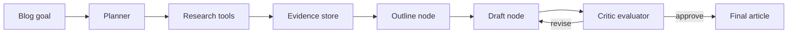

# Blog Research Agent

## Goal

Build an agent that plans, researches, outlines, drafts, critiques, and revises a technical blog.

## Architecture

## State

- topic
- audience
- constraints
- search_queries
- evidence
- outline
- draft
- critique
- iteration_count
- final_article

## Production Notes

Add citations, source quality scoring, duplicate detection, max iterations, and human review before publishing.
